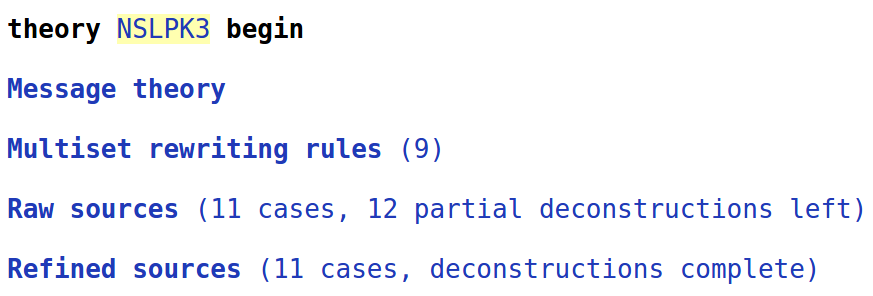

Precomputation
============== 
To better understand the precomputation of Tamarin and how it can cause open
chains, let us look at the example of the Needham-Schroeder-Lowe Public Key
Protocol. 

~~~~ {.tamarin include="code/example.spthy"}
~~~~

It is specified in Tamarin by the following rules:

~~~~ {.tamarin slice="code/NSLPK3.spthy" lower=32 upper=71}
~~~~

We want to examine if the following lemma holds:

~~~~ {.tamarin slice="code/NSLPK3.spthy" lower=105 upper=118}
~~~~

Open Chains
-----------

In precomputation, the Tamarin prover goes through all rules and computes
from what chain of rules the premisse of this rule could have been derived.

However, for some rules the Tamarin prover cannot resolve where a fact must
have come from. We call this an open chain.

Typically with open chains automatic proofs cannot be found.
For this reason, it is a good to find open chains and remove them.

In the interactive mode you can find open chains as follows.
On the top left, under "Untyped case distinction", you can find the chains
that were precomputed by Tamarin.

The unsolved chains can be identified by the light green arrows as in the
following example:

The green arrow indicates that the Tamarin tool thinks that the adversary can
derive any term ~t.1 with this rule I_2. 
As we are using an untyped protocol model, the tool does not see that nr.7
should be a nonce but it could generally be any message. For this reason
Tamarin concludes that it can derive any message with this rule.

To get a better understanding of the problem we can look at what happens if
Tamarin wants to proof the lemma "nonce_secrecy".
If we manually always choose the first case for the proof, we can see that 
Tamarin derives the secret key to decript the output of rule I_2 by
repeately using this rule I_2.

As it thinks that it can derive any message with the rule I_2, Tamarin
derives the secret key that is needed. The proof uses the same strategy over
and over again but will not terminate.

Typing Lemmas to Mitigate Open Chains
-------------------------------------
Once we identified the rules and cases in which open chains occur, we can 
try to avoid them.
Typically, we want to do this with typing lemmas.

Typing lemmas are a special case of lemmas. The statement of the typing
lemma will be assumed when proving the other lemmas. Also, typing lemmas
always use induction.
In our example we can add the following lemma:

~~~~ {.tamarin slice="code/NSLPK3.spthy" lower=86 upper=102}
~~~~

This lemma relates the point of instantiation to the point of sending by
either the adversary or the communicating partner.
In other words it says that whenever the responder receives the first nonce, 
either the nonce was known to the adversary or the initiator sent the first
message prior to that moment. Similarly, the second part states that
whenever the initiator receives the second message, either the adversary
knew the corresponding nonce or the responder has sent the seconde message
before.

With this typing lemma, Tamarin can then automatically proof the lemma
"nonce_secrecy". Futher, the typing lemma itself can be automatically proven.

Another possibility is that the open chains only occur in an application of
a rule that we do not want to consider in our model.
In such a case we can explicitly exclude this application of the rule with an
axiom. 

